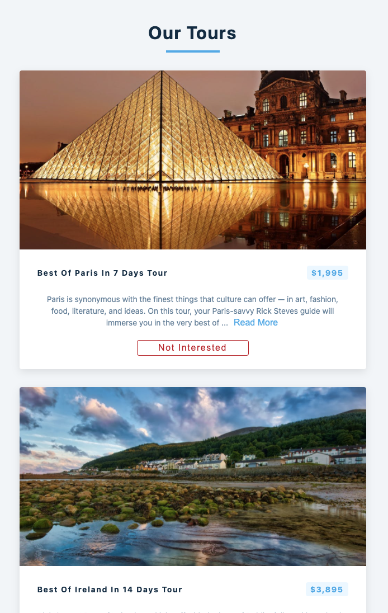

## Tours-List

- To run the project:

```
npm install && npm start
```

- Steps to create this project

1. declare useState
2. Try loading data
3. Fetch data using url, useEffect()
4. TryCatch loading error, setLoading(false), setTours
5. Tours Component
6. Single tour component
7. Show readMore or show less button
8. Remove tours
9. Reload

## UI preview


